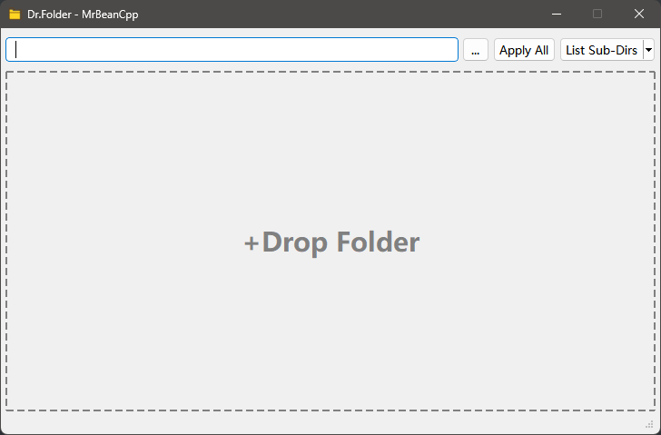
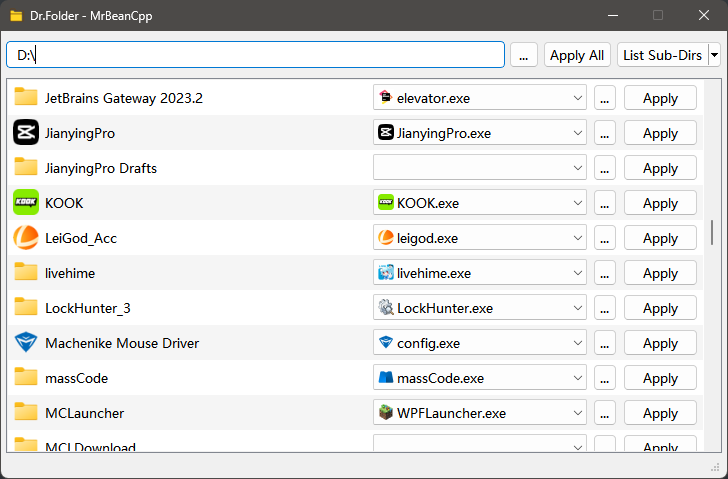

# Dr.Folder

自动搜索适合您应用程序的代表性文件夹图标

> 基于这样一个事实：一款软件常以**文件夹**的形式存在，且核心通常为一个**可执行文件**（`exe`）；形成一一对应关系

## Features

- 专为**软件安装目录**设计，自动搜索`exe`图标，核心可执行文件才最具代表性
- **批量操作**：可同时观察并操作多个子文件夹，避免依次设置的烦恼
- 自定义：可手动选择任意图标文件（`.exe` `.ico`）
- 可还原：通过右键菜单即可快速恢复默认图标

## Snapshot

## Links

[更改文件夹图标 & 使其立即生效 - MrBeanC-Blog](https://blog.cls.ink/2024/07/27/Set-Folder-Icon-and-Refresh-Cache-Immediately/)
